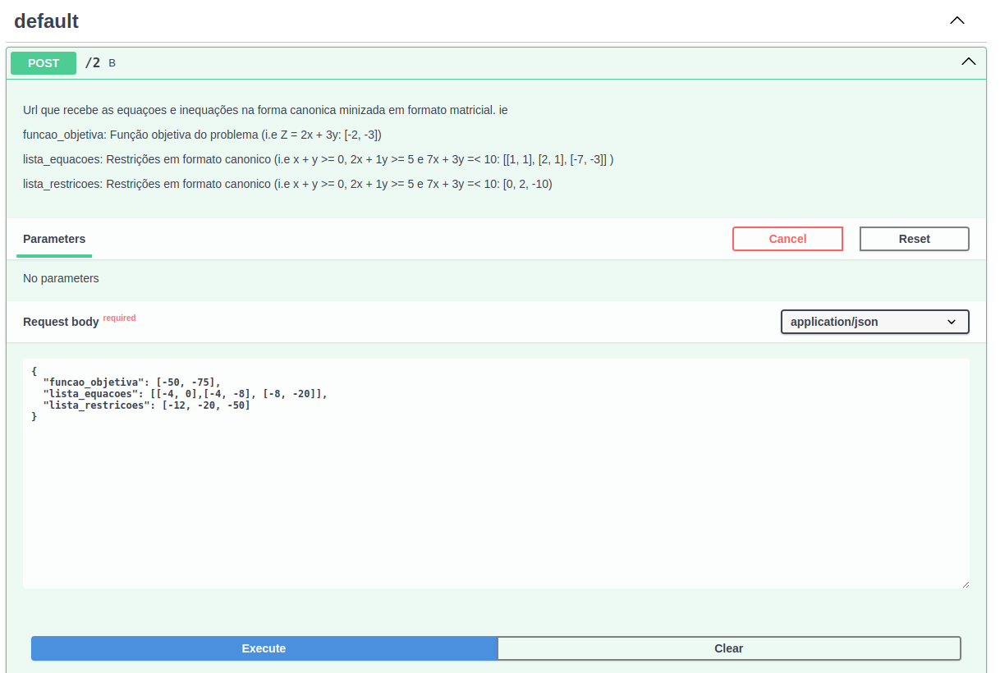
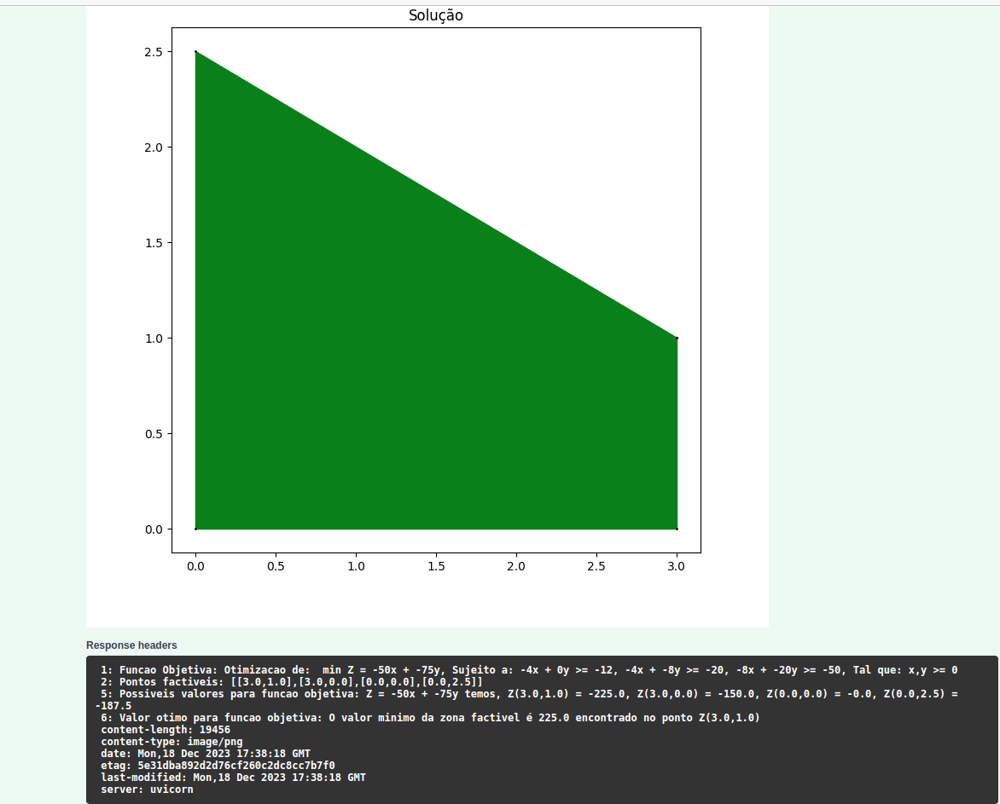

# Questão 2 do trabalho de FPO PPCA 2/2023
TO DO: Pequena descrição

### Alunos:
TO DO: Tabela com matricula e alunos

## Instação

TO DO: Steps para a instação utilizando o pip

## Usando 

TO DO: Steps subindo a API com unicorn
TO DO: Steps para interagir com a URL

## Exemplos 

TO DO:
Exemplos de entrada na url com a imagem de exemplo

TO DO: 
Exemplo de saida esperada e como interpretar a saida

