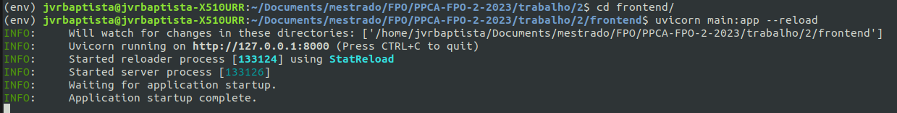

# Questão 2 do trabalho de FPO PPCA 2/2023

## Instação

Passo a passo para instalação de requisitos Python usando pip e requirements.txt

### Requisitos

Python 3 ou superior Pip

### Passos

Se você deseja instalar as dependências em um ambiente virtual, siga estas etapas:

Crie um ambiente virtual. Você pode usar o comando virtualenv para criar um ambiente virtual:

```console 
$ virtualenv ENV 
```

Este comando criará um diretório chamado ENV que contém um ambiente virtual Python.

Ative o ambiente virtual. Para ativar o ambiente virtual, execute o seguinte comando:

```console
$ cd ENV
$ source bin/activate
```
Instale as dependências. Agora você pode instalar as dependências listadas no arquivo requirements.txt no ambiente virtual:

```console
$ pip install -r requirements.txt
```

Após concluir a instalação, você poderá começar a usar seus pacotes Python.

## Usando 

Dentro do ambiente com os requirements.txt instalados

### Usar o jupyter lab

```console
$ jupyter lab
```

Utilive a pasta de /notebooks para interagir com os notebooks criados.

### Usando o frontend
Entre na pasta /frontend e execute o comando para subir a API.

```console
$ cd frontend
$ uvicorn main:app --reload
```

Resultado esperado:


## Frontend

### Descrição

Esta API fornece uma maneira de gerar as respostas da questão 2 utitilizando uma API feita em FastAPI com uma unica URL POST que recebe parametros da função e retorna .

### Requisição

### URLs

#### GET /docs

**Nome:** Documentação SWAGGER da API

**Descrição:** Obtem uma visão geral das rotas disponiveis na API, serve como frontend para interagir com as outras URLs..

**Método:** GET

**URI:** /docs#

**Exemplos:**

curl -X GET http://127.0.0.1:8000/docs#


#### GET /docs#/default/b_2_post

**Nome:** Frontend para interagir com a URL de POST da questão 2 b

**Descrição:** Frontend para inserir os parametros de entrada e vizualizar a imagem de saida e as respostas.

**Método:** GET

**URI:** /docs#/default/b_2_post

**Exemplos:**

curl -X GET http://127.0.0.1:8000//docs#/default/b_2_post


## Exemplos para a Questão 24 da Lista

Deve-se entrar no seguinte formado canonico de minimização qualquer problema.

Exemplo de problema proposto:

Maximizar: $Z = 50x1 + 75x2$

Sujeito a: 

$4x1 <= 12$ 

$4x1 + 8x2 <= 20$

$8x1 + 20x2 <= 50$

Tal que: 
$x1, x2 >= 0$

### Input na API
Exemplo de entrada na API deve seguir o seguinte formato no Body da requisição POST: 

```console
{
  "funcao_objetiva": [-50, -75],
  "lista_equacoes": [[-4, 0],[-4, -8], [-8, -20]],
  "lista_restricoes": [-12, -20, -50]
}
```
```console
curl -X 'POST' \
  'http://127.0.0.1:8000/2' \
  -H 'accept: application/json' \
  -H 'Content-Type: application/json' \
  -d '{
  "funcao_objetiva": [-50, -75],
  "lista_equacoes": [[-4, 0],[-4, -8], [-8, -20]],
  "lista_restricoes": [-12, -20, -50]
}'
```

Exemplos de entrada na url com a imagem de exemplo


### Output na API 

Deve-se capturar a resposa escrita da API pelo header.results (i.e):
```JSON
 {
    "1": "Funcao Objetiva: Otimizacao de:  min Z = -50x + -75y, Sujeito a: -4x + 0y >= -12, -4x + -8y >= -20, -8x + -20y >= -50, Tal que: x,y >= 0",
 
    "2": "Pontos factiveis: [[3.0,1.0],[3.0,0.0],[0.0,0.0],[0.0,2.5]]",
 
    "5": "Possiveis valores para funcao objetiva: Z = -50x + -75y temos, Z(3.0,1.0) = -225.0, Z(3.0,0.0) = -150.0, Z(0.0,0.0) = -0.0, Z(0.0,2.5) = -187.5",
 
    "6": "Valor otimo para funcao objetiva: O valor minimo da zona factivel é 225.0 encontrado no ponto Z(3.0,1.0)}"
 ```
Exemplo de saida esperada e como interpretar a saida


## Open Source [](https://github.com/ellerbrock/open-source-badges/)

- [Contribution Guide](./contributing.md)
- [Style Guide](./STYLE_GUIDE.md)
- [Code of Conduct](./CODE_OF_CONDUCT.md/)
